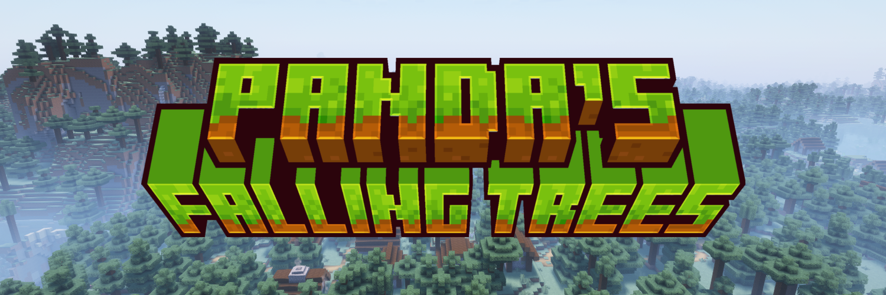
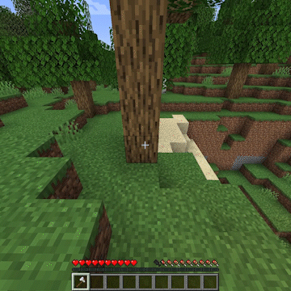

> [](https://discord.gg/wjPt4vEfXb)
> [](https://modrinth.com/mod/pandas-falling-trees)
> [](https://www.curseforge.com/minecraft/mc-mods/pandas-falling-trees)
> [](https://github.com/PandaDap2006/Pandas-Falling-Trees)
>
> [](https://www.curseforge.com/minecraft/mc-mods/pandalib)
> [](https://www.curseforge.com/minecraft/mc-mods/fabric-api)

## About:

Panda's Falling Trees makes every tree fall like trees from [Dynamic trees](https://www.curseforge.com/minecraft/mc-mods/dynamictrees), while still maintaining
the original trees from Vanilla Minecraft.

The mod should support other mods if log and leaves blocks are a part of the log and leaves Block Tag

### Supported versions and mod loaders:

| Mod loader | Versions          |
|------------|-------------------|
| Fabric     | 1.20 – 1.21.10    |
| NeoForge   | 1.20.5 – 1.21.10  |
| Forge      | Support has ended |

Development is targeted 1.21.10

## Showcase:



---

### Development:

#### Looking for a specific version's codebase

- **1.21**
  - [1.21.10](https://github.com/ThePandaOliver/Pandas-Falling-Trees/tree/versions/1.21.10)
  - [1.21.9](https://github.com/ThePandaOliver/Pandas-Falling-Trees/tree/versions/1.21.9)
  - [1.21.8](https://github.com/ThePandaOliver/Pandas-Falling-Trees/tree/versions/1.21.8)
  - [1.21.7](https://github.com/ThePandaOliver/Pandas-Falling-Trees/tree/versions/1.21.7)
  - [1.21.6](https://github.com/ThePandaOliver/Pandas-Falling-Trees/tree/versions/1.21.6)
  - [1.21.5](https://github.com/ThePandaOliver/Pandas-Falling-Trees/tree/versions/1.21.5)
  - [1.21.4](https://github.com/ThePandaOliver/Pandas-Falling-Trees/tree/versions/1.21.4)
  - [1.21.3](https://github.com/ThePandaOliver/Pandas-Falling-Trees/tree/versions/1.21.3)
  - [1.21.2](https://github.com/ThePandaOliver/Pandas-Falling-Trees/tree/versions/1.21.2)
  - [1.21.1](https://github.com/ThePandaOliver/Pandas-Falling-Trees/tree/versions/1.21.1)
  - [1.21.0](https://github.com/ThePandaOliver/Pandas-Falling-Trees/tree/versions/1.21)
- **1.20**
  - [1.20.6](https://github.com/ThePandaOliver/Pandas-Falling-Trees/tree/versions/1.20.6)
  - [1.20.5](https://github.com/ThePandaOliver/Pandas-Falling-Trees/tree/versions/1.20.5)
  - [1.20.4](https://github.com/ThePandaOliver/Pandas-Falling-Trees/tree/versions/1.20.4)
  - [1.20.3](https://github.com/ThePandaOliver/Pandas-Falling-Trees/tree/versions/1.20.3)
  - [1.20.2](https://github.com/ThePandaOliver/Pandas-Falling-Trees/tree/versions/1.20.2)
  - [1.20.1](https://github.com/ThePandaOliver/Pandas-Falling-Trees/tree/versions/1.20.1)
  - [1.20.0](https://github.com/ThePandaOliver/Pandas-Falling-Trees/tree/versions/1.20)

#### Kotlin DSL

```kotlin
repositories {
	mavenCentral()
	maven("https://repo.pandasystems.dev/maven/maven/")
}

dependencies {
	modApi("dev.pandasystems:fallingtrees-common-<game version>:<version>") // Common
	api("dev.pandasystems:fallingtrees-neoforge-<game version>:<version>")  // NeoForge
	modApi("dev.pandasystems:fallingtrees-fabric-<game version>:<version>") // Fabric
}
```

---

## Advertisement:

> ### Thanks to **Kinetic Hosting** for supporting this project
> [](https://billing.kinetichosting.com/aff.php?aff=476)
>
> Every purchased server via my [affiliate link](https://billing.kinetichosting.com/aff.php?aff=476) will help support me and my work.

## License

The project is licensed under the GNU GPLv3